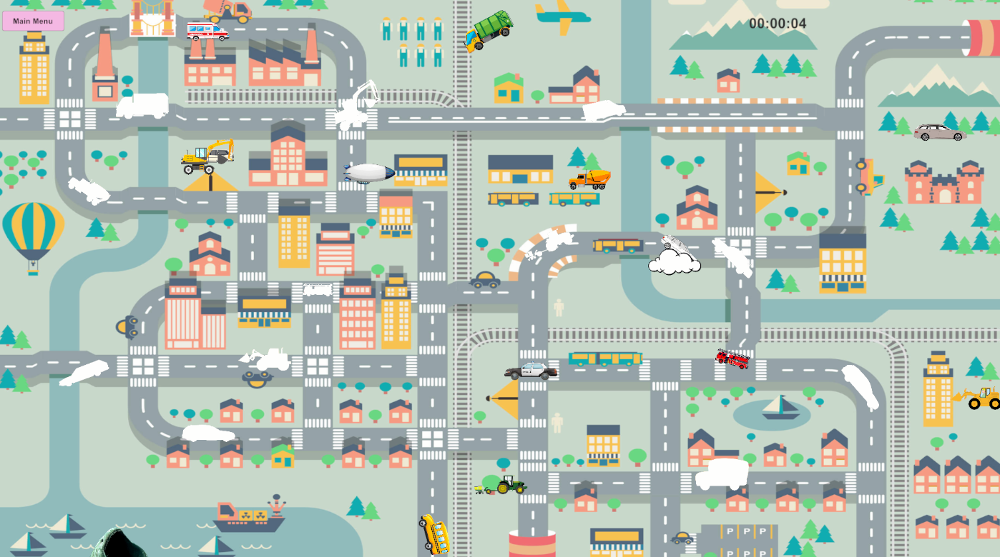
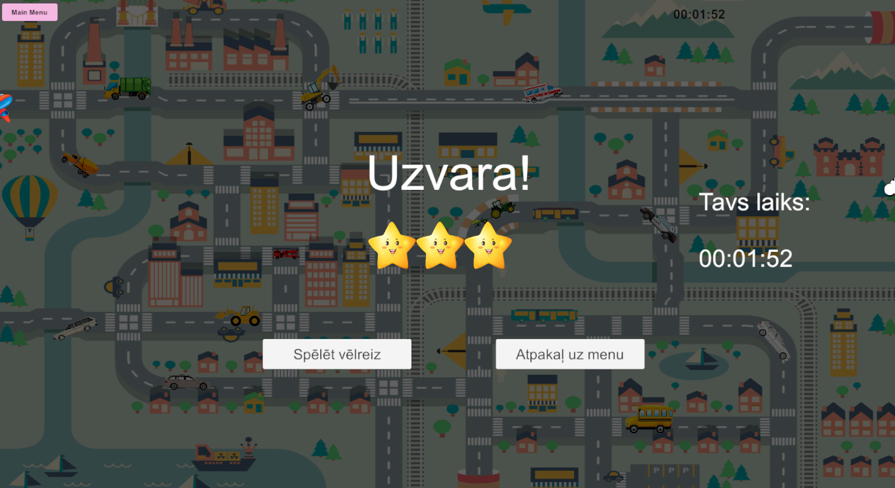
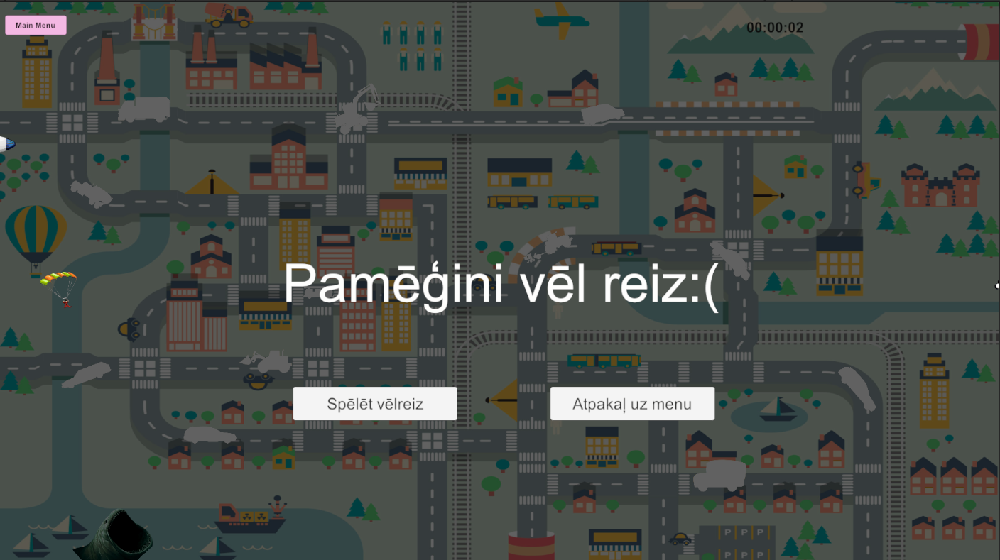

# 🎮 DragAndDrop Games

**Drag-n-Drop** is a collection of mini-games for children 6+ where players drag and drop cars onto their correct spots while interacting with flying obstacles and animated objects.

---

## 🏆 Game Objectives

* 🚗 Place all cars in their designated spots.
* ⏱️ Complete the level as fast as possible to earn maximum stars.
* ☁️ Avoid flying clouds, planes, and bombs that can destroy cars.
* 🌟 Get performance feedback at the end of the game.

---

## 🕹️ How to Play

1. Click and drag a car to move it around the map.
2. Use **Z** and **X** keys to rotate the car into the correct orientation.
3. Complete all placements as quickly as possible.
4. Watch out for flying obstacles—clouds, planes, and bombs!
5. At the end of the game, the win screen shows:

   * 🕒 Completion time
   * ⭐ Stars based on performance:

     * ⏱️ under 2 minutes → ⭐⭐⭐
     * ⏱️ 2–3 minutes → ⭐⭐
     * ⏱️ more than 3 minutes → ⭐

---

## ✨ Features

* 🖱️ **Drag & Drop System** – smooth and intuitive car movement.
* 🔄 **Transformation Script** – scale, rotate, and adjust objects.
* 📌 **Object Fixation** – cars snap into correct positions.
* 🎥 **Camera Controller** – zoom in/out and movement restrictions.
* 🔊 **Sound System** – background music and interaction effects.
* ☁️ **Animated Obstacles** – clouds, planes, bombs with destroy effects.
* 🎬 **Animated Main Menu** – buttons, animations, and sounds.
* ⏱️ **Game Timer** – displays time in HH:MM:SS format.

---

## 📝 To-Do List

- [x] Create project folders
- [x] Add all necessary assets
- [x] Place cars on the map
- [x] Implement Drag & Drop script
- [x] Implement transformation script
- [x] Implement object fixation script
- [x] Add sounds and audio sources
- [x] Create winning logic and star system
- [x] Add level timer
- [x] Create animated main menu with 3 buttons
- [x] Implement flying obstacles (clouds, planes, bombs)
- [x] Random car spawner
- [x] Add collision effects for destroyed cars
- [x] Hanoi

---

## 📸 Screenshots
* Main Menu

* Gameplay Scene with cars and obstacles

* Win Screen showing stars and completion time

* Lose Screen

---
# 🧠 Hanoi Tower

Hanoi Tower is a classic logic puzzle where the player must move all disks from the first tower to the last one while following strict rules. The game includes drag-and-drop movement, physics, and automatic win detection.

## 🕹️ How to Play
* Drag the top disk from any tower to another tower.
* You can move only one disk at a time.
* A bigger disk cannot be placed on a smaller one.
* Move all disks to the third tower to win.

## ✨ Features
* 🖱️ Physics-based Drag & Drop – disks use Rigidbody + Colliders.
* 📏 Size Validation – prevents placing large disks on smaller ones.
* 🗼 Tower Detection – disks automatically snap into towers.
* 🏆 Win Condition System – checks when all disks are moved correctly.
* 📜 Rules Window – opens/closes through UI buttons.

## 📸 Screenshot

